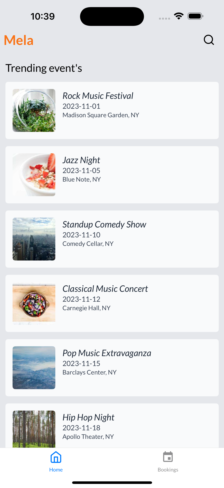
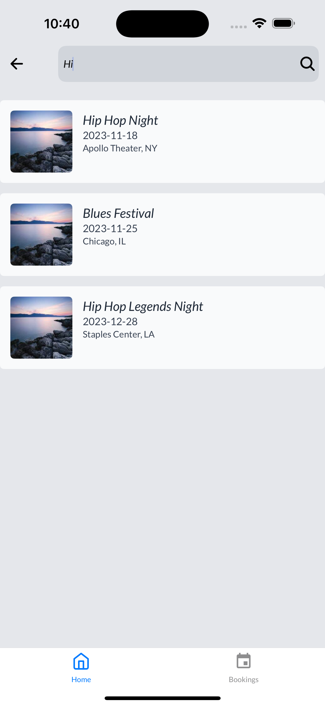
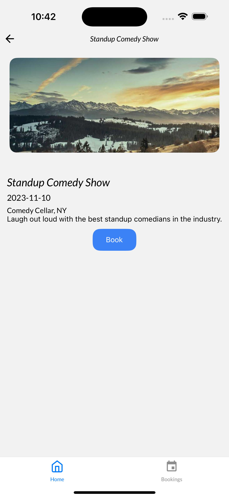
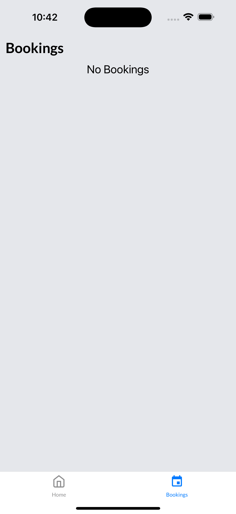

# Event Booking App

Welcome to the Event Booking App! This project is built using Expo for the frontend and JSON Server for the mock API.

## Screenshots

<!-- 


] -->
<div style="display: flex; flex-wrap: wrap; gap: 10px;">
  
  
  
  
  
</div>

## Table of Contents

- [Introduction](#introduction)
- [Features](#features)
- [Installation](#installation)
- [Usage](#usage)

## Introduction

The Event Booking App allows users to browse, book, and manage events seamlessly. It is designed to provide a smooth user experience with a responsive interface.

## Features

- Browse events
- Book events
- Manage bookings
- Responsive design
- RTK query for fetching data
- Redux for state management
- JSON Server for mock API
- NativeWind for styling

## Installation

- Mock API with JSON Server
- To start the JSON Server, run the following command:

  ```sh
  npm i -g json-server && cd server && json-server --watch db.json
  ```

### Prerequisites

- Node.js
- Expo CLI
- JSON Server

### Steps

1. Clone the repository:

   ```sh
   git clone https://github.com/yourusername/event-booking-app.git
   cd event-booking-app
   ```

2. Install dependencies:

   ```sh
   npm install
   ```

3. Start the Expo app:
   ```sh
   npm start
   ```

## Usage

1. Open the Expo app on your mobile device or use an emulator.
2. Scan the QR code generated by the Expo CLI.
3. Browse and book events through the app.
